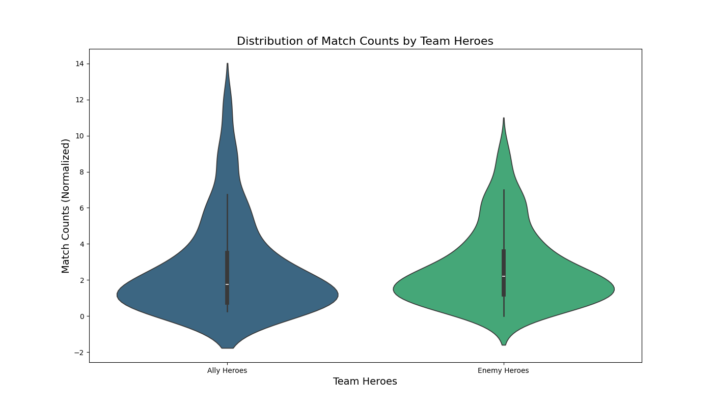
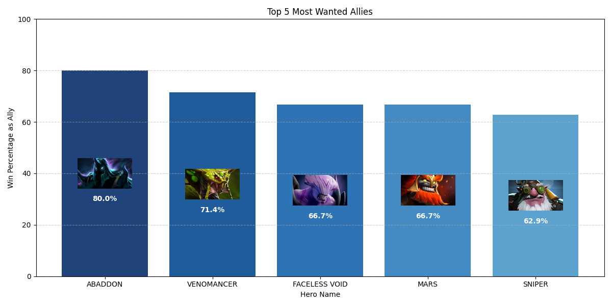
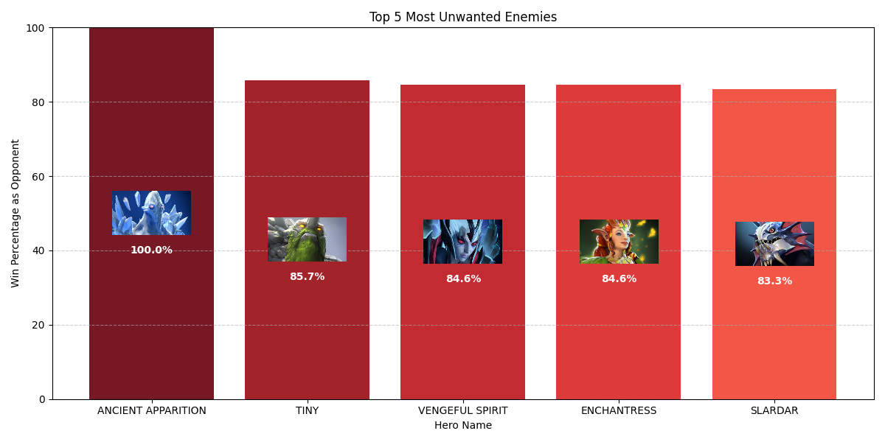
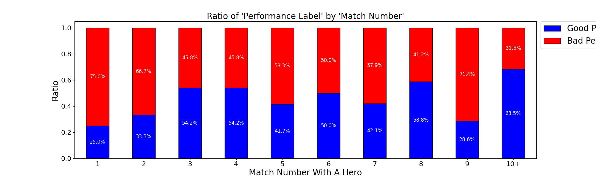
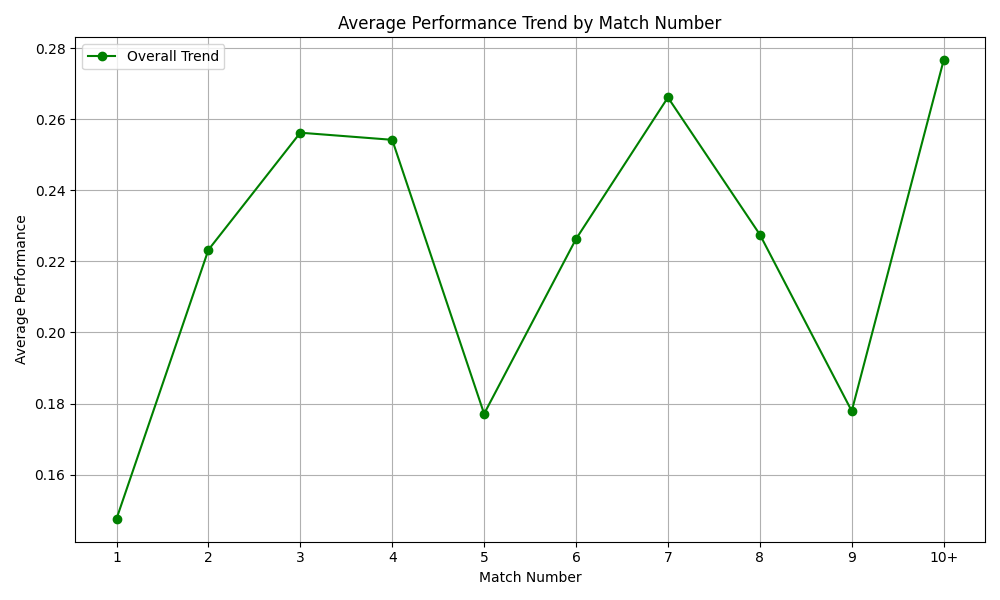
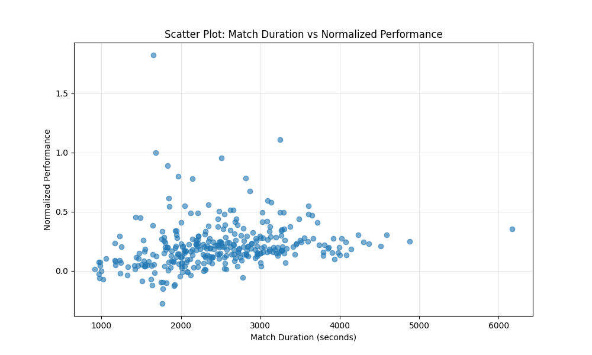
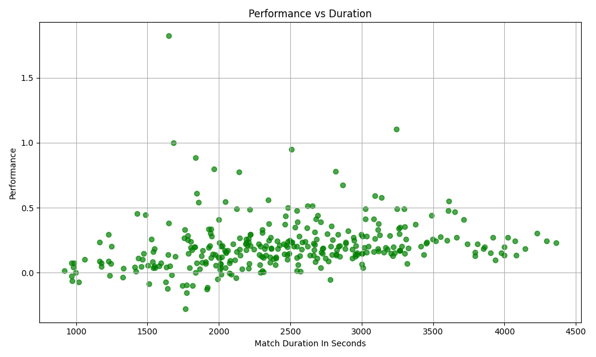
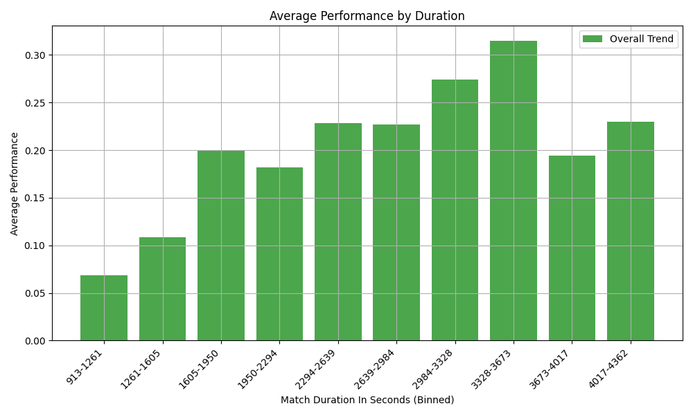
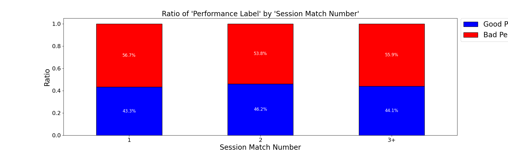
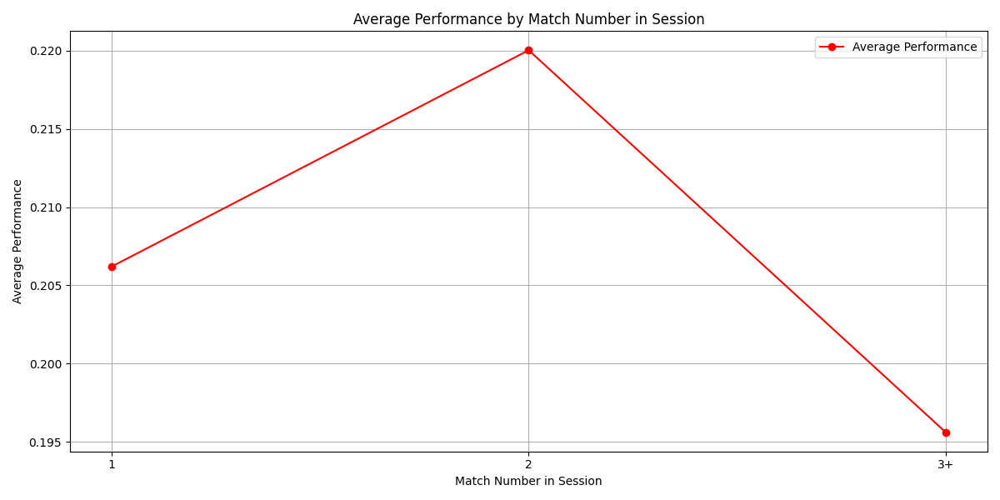

# Personal Dota 2 Data Analysis Project - Report

---

## **Project Overview**
This project focuses on analyzing my personal Dota 2 gaming data to uncover patterns and insights into my gaming behavior. By exploring various aspects of my gameplay history, I aim to answer specific research questions that delve into hero preferences, performance trends, and factors affecting match outcomes. The data sources include my personal match history, official Dota 2 APIs, and web-scraped hero information from the Dota 2 website.

---

## **Motivation**
This project stems from my curiosity to understand my gaming patterns and improve my overall gameplay experience. By systematically analyzing data, I aim to uncover actionable insights that can enhance my performance and make my Dota 2 experience more enjoyable.

---

## **Data Collection**

### **1. Personal Match History(data_extraction.ipynb and data_proccessing.ipynb)**
- **Source:** Steam Web API  
- **Endpoint:**  
  ```
  https://api.steampowered.com/IDOTA2Match_570/GetMatchHistoryBySequenceNum/v1/?key={API_KEY}&start_at_match_seq_num={match_seq_num}
  ```
- **Collected Data:**
  - General match details:  
    - Duration, start time/date, winning team, game mode, total kills for both teams, tower status for both teams, match sequence number.
  - Player performance metrics:  
    - Kills, deaths, assists, gold per minute, XP per minute, last hits(killing enemy creeps), denies(killing friendly creeps), net worth(total gold gain throught the game), level, and team assignment.

---

### **2. General Game Information(heroes.ipynb)**
- **Source:** Official Dota 2 API  
- **Endpoints:**  
  - **Heroes:**  
    ```
    https://www.dota2.com/datafeed/herolist?language=English
    ```
- **Collected Data**
  - **Heroes Data**:
    - Includes hero IDs, hero names.
    - Useful for mapping hero IDs from my matches to hero names.
    
### **3. Hero Characteristics(heroes.ipynb)**
- **Source:** Web scraping the Dota 2 website using Selenium.  
- **Collected Data:**  
  - Role distribution for each hero (carry, support, disabler, etc.), active skill count of heroes, hero attribute(strength, agility, intelligence, universal), attack range(melee or ranged) and hero images.  
  - This data is used to form a performance metric based on hero roles. Hero images are used just for visualization purposes.

---

## **API and Permissions**
To retrieve my personal data:
- **Steam API Key:** Obtained from my Steam account.
- **Profile Configuration:**  
  - Profile and game details set to **public**.  
  - "Expose Public Match Data" enabled in Dota 2 game options.  
- **API Usage Limitations:**  
  - Steam API allows up to 100,000 calls per day ([Steam API Terms](https://steamcommunity.com/dev/apiterms)).  
  - I ensure compliance with privacy terms and avoid accessing confidential player data.  
- **Security:** My API key is excluded from the repository to maintain security. I keep it in constants.py which is excluded from the repository by using .gitignore.

---

## **Analysis**
- NOTE: All test are performed with a significance level of 0.05, null hypothesis is rejected when p-value is smaller than 0.05.
1. **Analysis of ally heroes and enemy heroes**  
   - Performed mean comparison test using t-test to find out if match count(number of times that the hero played against me or with me) distribution for ally has higher mean than mean of distribution of enemy heroes. I normalized match counts since there's 4 ally and 5 enemy within a match. I divided each match count by 4 for allies and divided each match count by 5 for enemies. Null hypothesis suggests that their mean is equal while alternative hypothesis suggests that mean of allies is greater. **Results**: *p-value* is 0.9487, which is greater than 0.05, so we fail to reject null hypothesis.
   - Performed variance comparison test using f-test to find out variability comparison in match count distribution of allies and match count distribution of enemies. I divided each match count by 4 for allies and divided each match count by 5 for enemies. Null hypothesis suggests that their variance is equal while alternative hypothesis suggests that mean of allies is greater. **Results**: *p-value* is 0.0053, which is smaller than 0.05, so we reject null hypothesis, we accept alternative hypothesis.
   

   - Performed mean comparison test using t-test to find out if win percentage distribution for ally has higher mean than mean of distribution of enemy heroes. Null hypothesis suggests that their mean is equal while alternative hypothesis suggests that mean of allies is greater. **Results**: *p-value* is 0.0000, which is smaller than 0.05, so we reject null hypothesis, we accept alternative hypothesis.
   - Performed variance comparison test using f-test to find out variability comparison in win percentage distribution of allies and win percentage distribution enemies. Null hypothesis suggests that their variance is equal while alternative hypothesis suggests that mean of allies is greater. **Results**: *p-value* is 0.0221, which is smaller than 0.05, so we reject null hypothesi, we accept alternative hypothesis.
   

   - Just for fun, I visualized win rates of most wanted allies! (Selected allies with at least 5 match)
   

   - I visualized win rates of most unwanted enemies! (Selected enemies with at least 5 match)
   


2. **Analysis of relation between number of matches played with a hero and performance?**  
   - Based on the average performance metric that we collected with heroes.ipynb, I label my performances as 'good' or 'bad'. If my performance for that hero is greater than the average performance that we get by examining 150 matches for that hero, I played 'good'; if not, I played 'bad'.
   - Formed a contingency table where rows represent the match number that I play with a hero and columns represent performance label. For example for row with label 1, I gather all 1st performances for my played heroes. In order to meet requirements of chi squared test, I decreased number of rows since some cells had very low expected frequency (no cell should have expected frequency lower than 5). I gathered all matches bigger than 10 into '10+'. Again 10+ means matches where I play that hero for 15th time or more. I calculated the degree of freedom with formula: df=(# of rows - 1)(# of columns - 1).

   - Performed chi-squared test to find out relation between match number with a hero and performance. Null hypothesis suggests that they are independent while alternative hypothesis suggests that they're dependent. **Results**: *p-value* is 0.005712219058147729, which is smaller than 0.05, so we reject null hypothesisi, we accept alternative hypothesis.
   

   - It's important to note that the last result doesn't suggest that performance increases as a player play more matches, it just suggests that, cathegorically, these values are dependent. I want to perform pearson correlation test to find numeric dependence of match number and performance. So I calculated 'good' percentages for every match number. Then I performed pearson correlation test. Null hypothesis suggests that they are not correlated while alternative hypothesis suggests that they are correlated. **Results**: *p-value* is 0.176512, which is greater than 0.05, so we fail to reject null hypothesis, we can not conclude in a correlation between match number(within a hero) and performance.
  


3. **Analysis of relation between duration and performance**  
   - I visualized my data in the form of a scatter plot to see distribution. I realized that there were some extreme values in x axis, I considered them as 'noise'. 
   

   - So I get only 0.99 percentile of the data to perform pearson correlation test to find out the correlation between 
   

   - Then I performed pearson correlation test to find out the correlation between these performance and duration of the match. Null hypothesis suggests that there is no correlation while alternative hypothesis suggests that there's correlation. **Results**: *p-value* is 0.000058, which is greater than 0.05, so we fail to reject null hypothesis, we accept alternative hypothesis.
   


4. **Analysis of following question: "Does the number of games played in one sitting affect performance or match result?"**  
   - Similar to chi squared test that I did for second analysis part, I gathered all matches with session match number(if this is the 3rd game in on seat, session match number is 3) greater than 3 into a single row called '3+'. Also like second analysis part, I labeled my matches as 'good' and 'bad'. I formed a contingency table with these settings. I calculated the degree of freedom with formula: df=(# of rows - 1)(# of columns - 1).

   - I performed chi-squared test to find out relation between session match number and performance. Null hypothesis suggests that they are independent while alternative hypothesis suggests that they're dependent. **Results**: *p-value* is 0.9046410925944919, which is greater than 0.05, so we fail to reject null hypothesisi.
   

   - This the visualization of average performance-session match number:
   


---

## **Machine Learning Model For 2 Regression Tasks
   - When I examined my dataset, I realized that tower_damage(total tower damage a hero deals during the match) and hero_damage(total hero damage a hero deals during the match) stats were not present for all matches. That's why I decided that it would be meaningful to form a ml model which predicts some missing data. So this models predict tower_damage and hero_damage.
   - For both tasks, I used the dataset that I collected in heroes.ipynb. These dataset was originally formed to create an average performance metric for every hero. There's 4690 matches and each match contains 10 players, so my dataset has 46900 instances. 
   - I performed some feature engineering to decide on parameters of my model. Some irrelevant or non-accesible(at least not for my matches) features are ignored. 
   - I did log transformation on y values to protect the models from noisy values(extreme y values). So the models make predictions according to those y values, which give greater performance.
   - I used randomforestregressor as the model for both tasks, because they can model non-linear relations and they're robust to noisy data. I performed cross validation and gridsearch cv to decide best hyperparameters of my model.
   - **Result for tower_damage**: *Log Mean Squared Error*: 0.4084544279414639, *R^2 Score*: 0.4912709308532357
   - **Result for hero_damage**: *Log Mean Squared Error*: 0.002229542990831553, *R^2 Score*: 0.7706174336317602

   - **Interpretation of results**
      - For tower_damage prediction task, we get log MSE=0.4084544279414639 which is smaller than 0.5. This is a good indication of performance. But R^2 score of 0.4912709308532357 is low which suggests that the model can't explain well the variability in target variable.
      - For hero_damage prediction task, we get log MSE=0.002229542990831553 which is smaller than 0.5. This is a really good indication of performance clearly better than tower_damage predictions. This might happen because there is better representatives of hero_damage in feature like kills, assists and performance. We get R^2 score of 0.7706174336317602 which is not bad.

---

## **Tools and Methodology**
- **Programming Languages:** Python, Jupyter Notebook
- **Data Retrieval:** Steam Web API, Official Dota 2 API, Selenium and Beatiful Soup for web scraping.
- **Data Processing and Analysis:** Pandas, NumPy, Seaborn and Matplotlib libraries for data manipulation and visualization.
- **Machine Learning:** Scikit-learn library and all data processing tools mentioned above.
- **Security:** API keys are stored securely and not shared publicly.

---

## **Disclaimer**
All data collected and analyzed in this project complies with the terms and conditions of Steam and Dota 2. This project is for personal and educational purposes only, and no confidential or private information about other players is accessed or stored.

---

